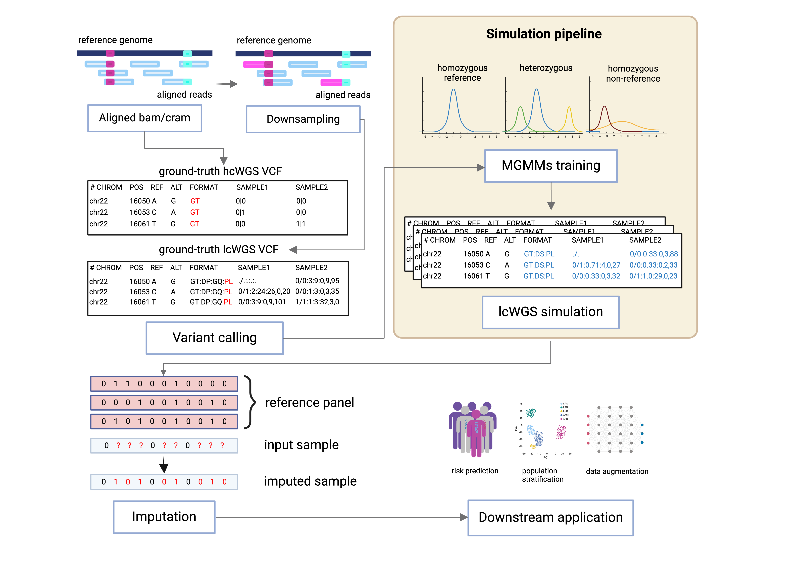
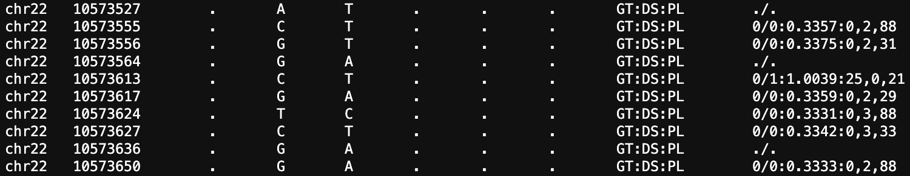

# lcWGS_simulation
A tool to simulate lcWGS MGMMs. This repository contains a Python script `simulate_1x.py` designed to process high-coverage whole-genome sequencing VCF files. The script takes an input VCF file and generates outputs in a directory of interest.


(The figure is Created with BioRender.com)

## Installation
Clone this repository to your local machine:
```
git clone https://github.com/chvbs2000/lcWGS_simulation.git
cd lcWGS_simulation
```

## Prerequisites
Before you run the script, ensure you have Python 3.8.3 installed on your system. You can download Python 3 from the official Python website.

### Package Versions Used:
This project uses the following package versions:

| Package        | Version   |
| -------------- | --------- |
| subprocess     | (standard library) |
| argparse       | 1.1       |
| multiprocessing| (standard library) |
| numpy          | 1.22.4    |
| random         | (standard library) |
| gzip           | (standard library) |
| allel          | 1.3.2     |
| decimal        | (standard library) |
| pandas         | 2.0.3     |
| os             | (standard library) |
| scikit-learn   | 1.3.0     |
| datetime       | (standard library) |


Ensure that the listed versions are installed in your environment for compatibility. You can install the specified versions using `pip` with the following command:

```bash
pip install numpy==1.22.4 pandas==1.3.3 scikit-learn==0.24.2 scikit-allel==1.3.3
```
### If using virtualenv
```
python -m venv myenv
source myenv/bin/activate
pip install numpy==1.22.4 pandas==1.3.3 scikit-learn==0.24.2 scikit-allel==1.3.3
```

### If using conda
```
conda create --name myenv numpy=1.22.4 pandas=1.3.3 scikit-learn=0.24.2 scikit-allel=1.3.3
conda activate myenv
```

## Usage
To use the script, you need to provide it with a VCF file and specify an output directory where the results will be stored. Here is the basic command structure:
```
python3 simulate_1x.py --input_vcf $vcf --output_dir $myoutdir
```

- `--input_vcf`: The path to the input VCF file. This should be a high-coverage whole-genome sequencing VCF file, for example, NA12878.chr22.30x.vcf.gz.
- `--output_dir`: The directory where the output files will be saved. If the directory does not exist, the script will create it.

### Test case: simulate chromosome 22 for genome build GRCh38

Here is an example command using a specific VCF file and output directory:
```
python3 simulate_1x.py --input_vcf ./demo_data/NA12878.chr22.30x.subset.vcf.gz --output_dir ./output
```
This command processes the VCF file NA12878.chr22.30x.subset.vcf.gz and places the output in the ./output directory. Make sure the output directory exist before run the code.

## Output
The script will generate a BGZF-compressed format simulated VCF files:



Ensure you have enough disk space and the necessary permissions to write to the directory.

## Support
For support, create an issue in this repository or contact the repository owner.
